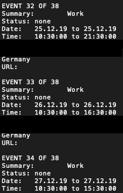
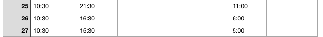

# workcal
###### by faydyn
Apple Calendar to .csv  
(with Automator (macOS only))
___
## Important
Create an Automator-Calendar event (repeated monthly) to automatically run the [workflow](automator/workcal.workflow)

## Overview

+ Automator does Event Summary of a Single Calendar (Choose Calendar, Default: _Work_ [Line 264](automator/workcal.workflow/Contents/document.wflow)))

+ python is run via apple-script (Update path: [Line 657](automator/workcal.workflow/Contents/document.wflow))

+ Saves csv to Desktop
___
Some other actions are for my own comfort (puts some alias to Desktop) and can be deleted without breaking the code.  
Only "work.txt" is necessary.

